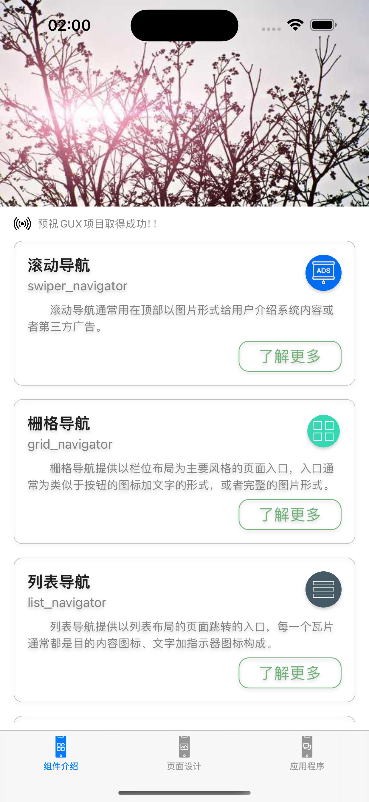
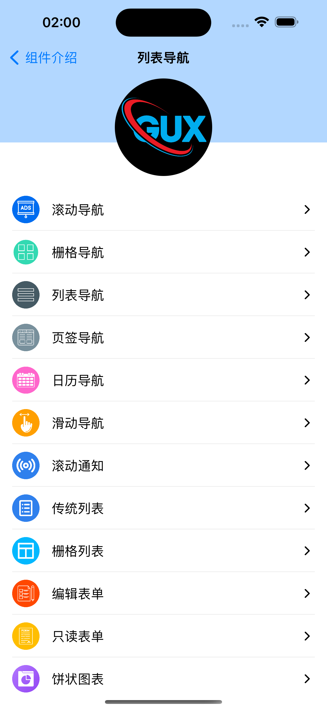
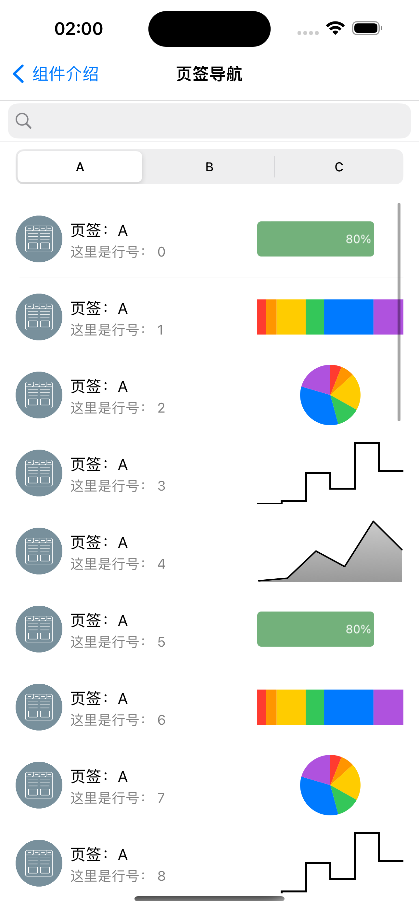
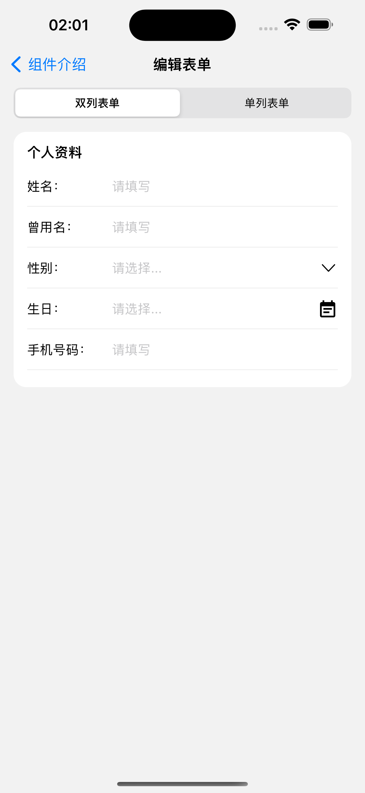
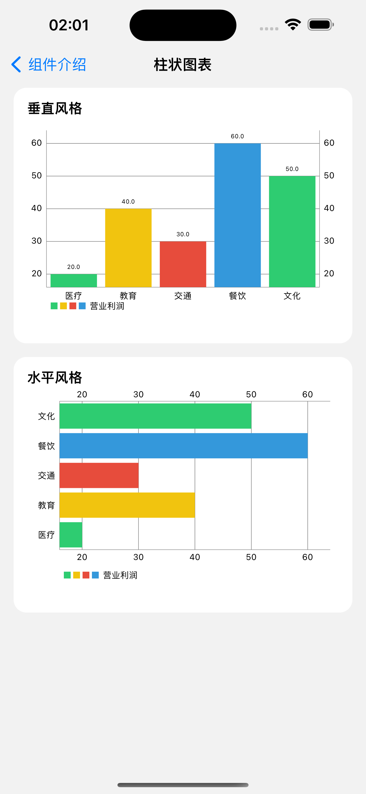

gux-cocoatouch-objectivec
=========================

This is a sub-project of GUX framework for objective-c language under iOS CocoaTouch framework.

To learn more information about GUX framework please see other GUX projects for other languages.

| 首页 | 列表导航 | 页签导航 | 编辑表单 | 柱状图表 |
|----|----|----|----|----|
|  | |  |  |          